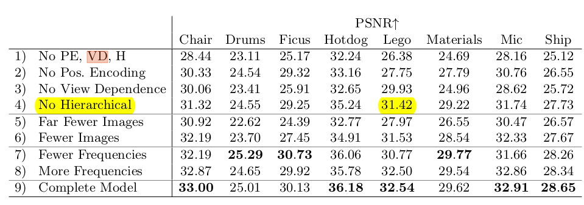
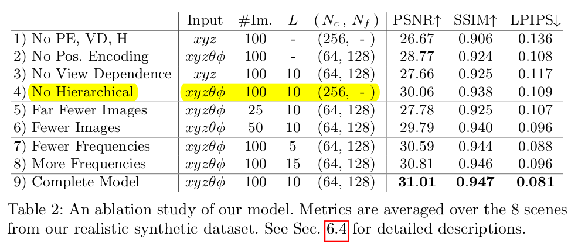

# NeRF---
NeRF---: Plus Version of NeRF--, optimize camera poses and NeRF in an end-to-end manner.

### Input & Assumptions
* Images: forward-facing setup
* Intrinsics: all images are captured with same intrinsic parameters
    * Here is different from original NeRF--, which also optimize intrinsic parameters

### Details
* Learnable Parameters
    * Pose: C2W(CameraToWorld) representation
        * we adopt axis-angle representation for pose, as in NeRF--
    * NeRF: vanilla MLP
        * no hierarchy sampling startegy
        * hidden layer dimension is 128 by default
        * kaiming initialization for MLP
        * vanilla positional encoding
            * PE(XYZ): 3 -> 6L+3 (L=10)
            * PE(Direction): 3 -> 6L+3 (L=4)
* Training Implementation
    * 128 points along each ray
    * 2 separate Adam optimizer for pose and NeRF respectively
        * initial learning rate: 0.001
        * NeRF's lr decay per 10 epochs by multiplying 0.9954
        * Pose's lr decay per 100 epochs by multiplying 0.9
    * total 10000 epochs
    * batchsize for inference: 40960 
    * batchsize for train: TODO 

### Support Dataset
 * **Blender**
 * **LLFF** 
    * https://www.robots.ox.ac.uk/~ryan/nerfmm2021/nerfmm_release_data.tar.gz.

### TODO
 * trying to reimplement vanilla NeRF
    * decide ray marching bounds, i.e. near and far
    * add tensorboard support
    * perturb on ray sampling, meaning of this ?
    * visualize the scene and pose, similar to NeRF++, instant-ngp may also provide a good check
    * learning rate decay
 * HashNeRF

### STATE
 * June 4. 256 Samples. Using epoch 29. PSNR: 24.966. 
 * June 6. 256 Samples. Using epoch 29. PSNR: 27.706. 
    * **may be I have not decided a reasonable bound, so PSNR is relative lower than orginal paper(31.42) (near=2, far=6)**

### NOTES on vanilla NeRF
 * Paper description
    * a batch size of 4096 rays
    * each sampled at Nc=64 coordinates in the coarse volume and Nf =128 additional coordinates in the fine volume
    * Adam optimizer with a learning rate that begins at 5 × 10 −4 and decays **exponentially** to 5 × 10 −5 over the course of optimization (other Adam hyperparameters are left at default values of 0.9, 0.999, 10-7).
    * The optimization for a single scene typically take around 100– 300k iterations to converge on a single NVIDIA V100 GPU (**about 1–2 days**)
    
    